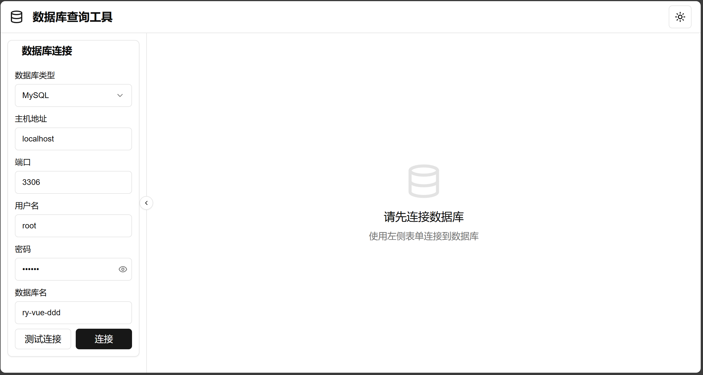

# Database Explorer Platform

[](https://github.com/mynxg/db-explorer-web/stargazers)
[](https://github.com/mynxg/db-explorer-web/issues)
[](https://github.com/mynxg/db-explorer-web/issues?q=is%3Aissue+is%3Aclosed)
[](https://github.com/mynxg/db-explorer-web/pulls)
[](https://github.com/mynxg/db-explorer-web/pulls?q=is%3Apr+is%3Aclosed)

[简体中文](README.md) | English

The Database Query Tool is a web application designed to facilitate database management and querying. It allows users to connect to various databases, execute SQL queries, and view results in a user-friendly interface.




## Features
- Support for multiple database types (MySQL, PostgreSQL, Oracle, SQL Server)
- Database connection management with auto-reconnect
- Table structure viewing
- Paginated table data browsing
- SQL query execution
- Multi-tab interface
- Dark/light theme switching
- Responsive design

## Tech Stack
- Frontend Framework: Next.js 14 (App Router)
- UI Components: Shadcn UI
- State Management: React Hooks
- Styling: Tailwind CSS
- Icons: Lucide React
- Notifications: React Toastify

### Installation and Running

#### Prerequisites
- Node.js 18.0 or higher
- npm or yarn or pnpm

#### Installation Steps
1. Clone the repository

```bash
git clone https://github.com/yourusername/database-query-tool.git
cd database-query-tool
```

2. Install dependencies

```bash
npm install
# or
yarn install
# or
pnpm install
```


3. Start the development server

```bash
npm run dev
# or
yarn dev
# or
pnpm dev
```

4. Open your browser and visit [http://localhost:3000](http://localhost:3000)


## Usage Guide

### Connect to Database

- Fill in the database connection information in the left panel
- Select the database type
- Enter the host address, port, username, password, and database name
- Click "Test Connection" to verify the connection information
- Click "Connect" to establish the database connection


### Browsing Table Structure

- After connecting to the database, the left panel will display the list of tables in the database
- Click on the table name to open the table tab
- Switch to the "Table Structure" tab to view the table's field definitions


### Viewing Table Data

- In the table tab, switch to the "Table Data" tab
- The data is displayed in a paginated manner
- Use the bottom pagination controls to browse more data


### Executing SQL Queries

- Click the "New Query" button in the upper right corner
- Enter the SQL statement in the SQL editor
- Click "Execute" to run the query
- The query results will be displayed below


## Configuration

This application uses environment variables for configuration. Create a `.env.local` file, which can include the following configuration:

```bash
NEXT_PUBLIC_API_URL=http://localhost:8076/api
```


## Development


### Project Structure

```
/
├── public/            # Static assets
├── src/
│   ├── app/           # Next.js app routes
│   ├── components/    # React components
│   ├── lib/           # Utility functions
│   └── types/         # TypeScript type definitions
├── .env.local         # Environment variables (create manually)
└── ...                # Other configuration files
```

## Backend Project:

API Service: [db-explorer](https://github.com/mynxg/db-explorer)

## Vercel Deployment Guide

Log in to [Vercel](https://vercel.com/) and create a new project.

Select to import a GitHub repository, then choose your project repository (`db-explorer-web`).

In the project settings, add an environment variable:

`VIDEO_APP_API_URL`: Set this to your API endpoint, e.g., `https://your-api-url.com`

Click the "Deploy" button to start deployment.

After deployment, you can access your application via the domain provided by Vercel.


## Contributing


Contributions are welcome! Please feel free to submit code, report issues, or suggest improvements. Follow these steps:

- Fork the repository
- Create a feature branch (git checkout -b feature/amazing-feature)
- Commit your changes (git commit -m 'Add some amazing feature')
- Push to the branch (git push origin feature/amazing-feature)
- Create a Pull Request

## License


This project is licensed under the MIT License - see the [LICENSE](LICENSE) file for details

## Star History

[](https://star-history.com/#mynxg/db-explorer-web&Date)

# Database Query Tool

## Overview

The Database Query Tool is a web application designed to facilitate database management and querying. It allows users to connect to various databases, execute SQL queries, and view results in a user-friendly interface.

## Features

- Connect to multiple database types (MySQL, PostgreSQL, etc.)
- Execute SQL queries and view results
- View table structures and data
- Save connection information for easy access
- Responsive design for various screen sizes

## Installation

1. Clone the repository:
   ```bash
   git clone https://github.com/yourusername/db-explorer-web.git
   cd db-explorer-web
   ```

2. Install dependencies:
   ```bash
   npm install
   ```

3. Create a `.env.local` file in the root directory and set the API base URL:
   ```env
   NEXT_PUBLIC_API_BASE_URL=http://localhost:8080/api
   ```

4. Start the development server:
   ```bash
   npm run dev
   ```

5. Open your browser and navigate to `http://localhost:3000`.

## Usage

1. Enter your database connection details (IP, port, username, password, and database name).
2. Click "Test Connection" to verify your connection settings.
3. If the connection is successful, click "Connect" to access your database.
4. Use the interface to execute SQL queries and view results.

## Contributing

Contributions are welcome! Please open an issue or submit a pull request for any improvements or bug fixes.

## License

This project is licensed under the MIT License. See the LICENSE file for more details.

